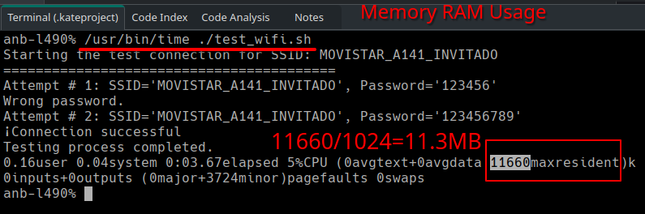
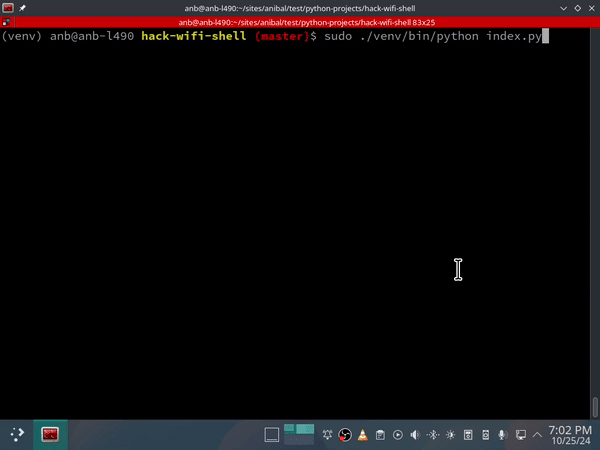

# Hack WiFi - Discover WiFi with Easy Passwords

This project provides two methods to discover WiFi networks with easily guessable passwords using a Bash script and a Python script.

## 01. With Shell bash script `test_wifi.sh`

To set the correct execution permissions, run:

    chmod +x test_wifi.sh
    ./test_wifi.sh

## Requirements:

- Enable wifi module in your PC `Linux`
- Shell `bash`

## how to see ram consumption

You must be install `/usr/bin/time` paquete GNU `time`

    sudo pacman -S time

Once installed, you can use `/usr/bin/time` directly

    /usr/bin/time -v ./test_wifi.sh

Result:

If you need monitor the whole process
you can use `top` or `htop` tool and find the process named `test_wifi.sh`

Preview:

## 02. With Python script (`index.py`)

**Note**: This script is currently not functional, but it is useful for understanding WiFi communication.

### Project Setup

    python -m venv venv
    source ./venv/bin/active
    pip install -r requirements.txt

### Execute the Application

**note**: error to access without `sudo`

`Permission denied: '/var/run/wpa_supplicant'`

Run the following command with sudo to access necessary network files:

    sudo ./venv/bin/python index.py 

### Error: Known Bug

Some WiFi modules do not return the correct connection status, which prevents me from determining when the password is correct. The problematic code is:  into the file `index.py`

    if iface.status() == const.IFACE_CONNECTED:

## Conclusion

This project emphasizes the importance of using strong passwords for your WiFi networks. Weak passwords are easily guessable, making your network vulnerable.

Feel free to explore the code and contribute to the project! :) 
